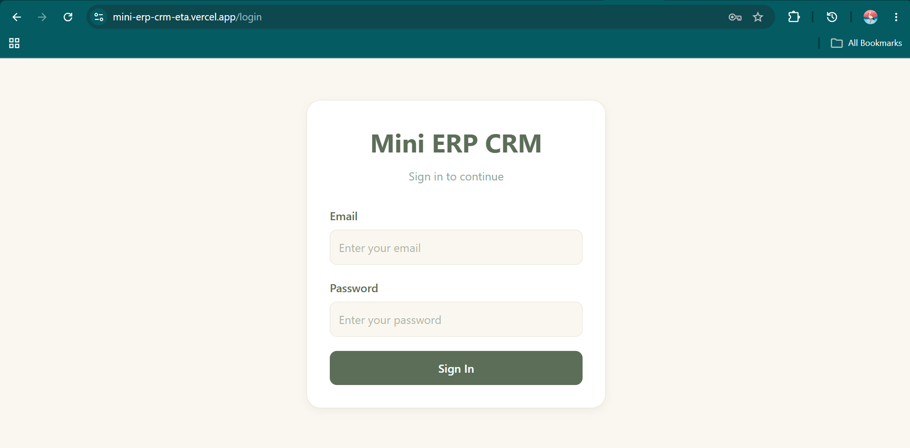
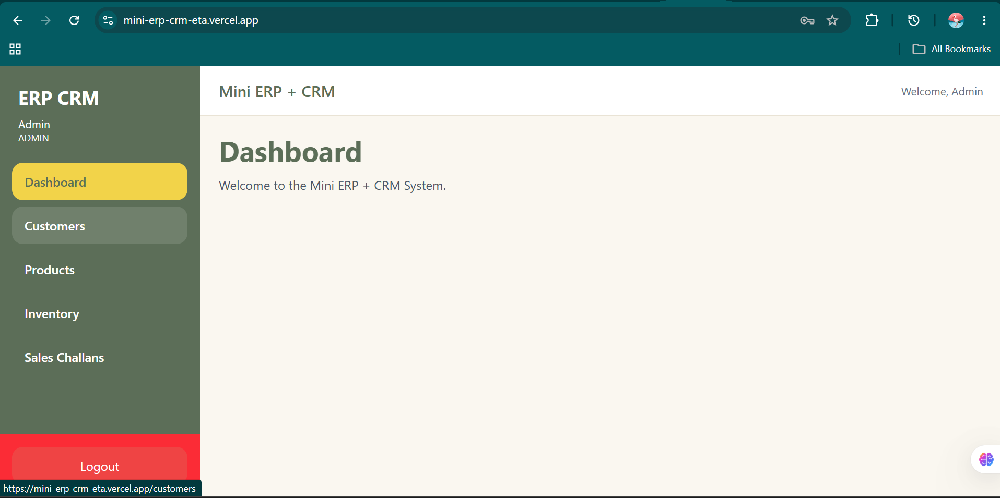
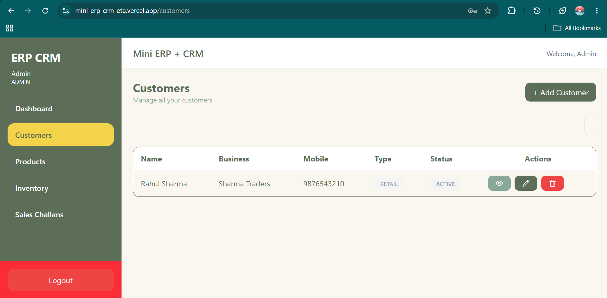
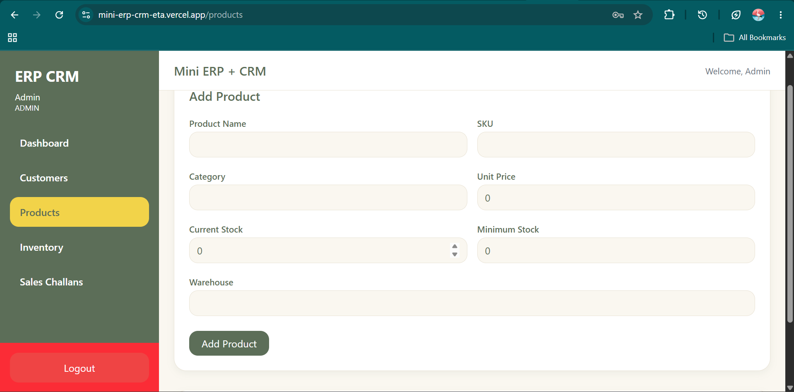
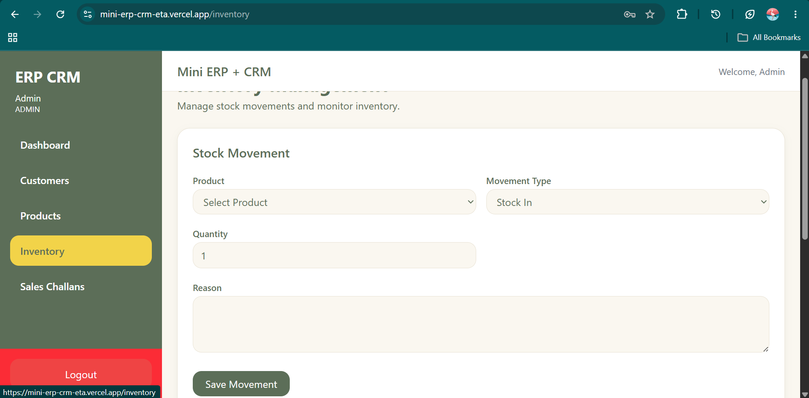
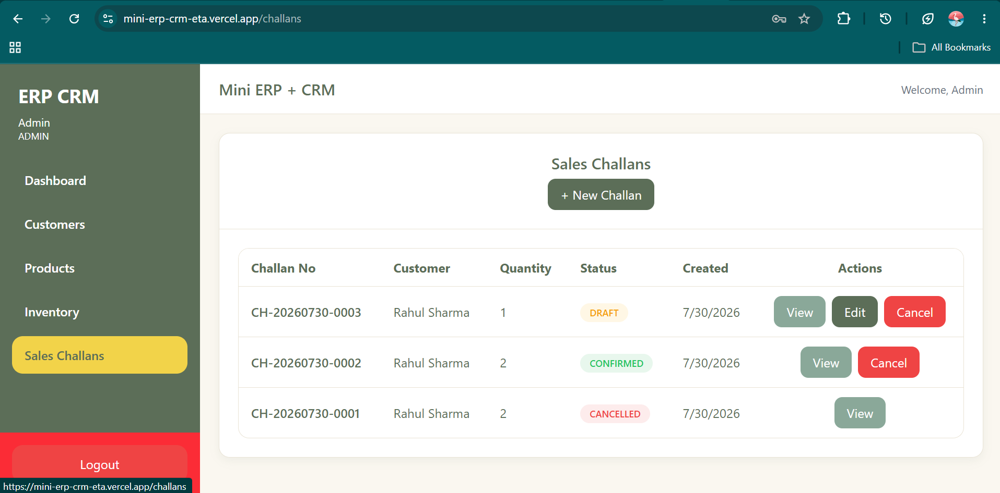

# Mini ERP + CRM

A full-stack **Enterprise Resource Planning (ERP)** and **Customer Relationship Management (CRM)** application built with modern web technologies. The platform provides secure, role-based authentication and dedicated modules for customer management, product management, inventory tracking, and sales challan management.

[](https://mini-erp-crm-eta.vercel.app)
[](https://mini-erp-crm-backend-5sgi.onrender.com)
[]()

---

## Live Demo

| Service | URL |
|---|---|
| Frontend | [mini-erp-crm-eta.vercel.app](https://mini-erp-crm-eta.vercel.app) |
| Backend API | [mini-erp-crm-backend-5sgi.onrender.com](https://mini-erp-crm-backend-5sgi.onrender.com) |

> **Note:** The backend is hosted on a free-tier instance and may take a few seconds to spin up after inactivity.

---

## Table of Contents

- [Overview](#overview)
- [Features](#features)
- [Tech Stack](#tech-stack)
- [Deployment](#deployment)
- [System Architecture](#system-architecture)
- [Project Structure](#project-structure)
- [Installation](#installation)
- [Default User Roles](#default-user-roles)
- [Demo Credentials](#demo-credentials)
- [REST API Reference](#rest-api-reference)
- [Screenshots](#screenshots)
- [Learning Outcomes](#learning-outcomes)
- [Future Enhancements](#future-enhancements)
- [Author](#author)
- [License](#license)

---

## Overview

Mini ERP + CRM streamlines core business operations by providing a centralized platform for managing customers, products, inventory, and sales. The application follows a clean, modular architecture with clearly separated frontend and backend services, and implements secure authentication with role-based access control throughout.

---

## Features

### Authentication & Authorization
- JWT-based authentication
- Secure login and logout flow
- Password hashing with bcrypt
- Protected routes
- Role-based access control (RBAC)

### User Roles
- Admin
- Sales
- Warehouse
- Accounts

### Dashboard
- Responsive layout
- Fixed sidebar and header
- Role-based navigation

### Customer Management
- Add, view, update, and delete customers
- Search customers

### Product Management
- Add, view, update, and delete products

### Inventory Management
- Stock in / stock out
- Inventory movement history
- Stock validation
- Prevention of negative stock

### Sales Challan
- Create sales challans
- Multiple products per challan
- Auto-generated challan numbers
- Draft and confirm statuses
- Product snapshot at time of creation

---

## Tech Stack

**Frontend**
- React
- TypeScript
- Vite
- React Router DOM
- React Query
- Axios
- React Hook Form
- Zod
- Tailwind CSS

**Backend**
- Node.js
- Express.js
- TypeScript
- Prisma ORM
- JWT Authentication
- bcrypt

**Database**
- PostgreSQL

---

## Deployment

| Layer | Platform |
|---|---|
| Frontend | Vercel |
| Backend | Render |
| Database | Neon PostgreSQL |

---

## System Architecture

```text
                 React + TypeScript
                        │
                    Axios (HTTP Client)
                        │
             Express.js + TypeScript (REST API)
                        │
                  Prisma ORM
                        │
             PostgreSQL (Neon Cloud)
```

---

## Project Structure

```text
mini-erp-crm/
│
├── frontend/
│   ├── src/
│   │   ├── api
│   │   ├── components
│   │   │   ├── common
│   │   │   ├── forms
│   │   │   ├── layout
│   │   │   ├── tables
│   │   │   └── ui
│   │   ├── constants
│   │   ├── context
│   │   ├── hooks
│   │   ├── layouts
│   │   ├── lib
│   │   ├── pages
│   │   │   ├── auth
│   │   │   ├── customers
│   │   │   ├── products
│   │   │   ├── inventory
│   │   │   ├── challans
│   │   │   ├── dashboard
│   │   │   └── not-found
│   │   ├── routes
│   │   ├── schemas
│   │   ├── services
│   │   ├── styles
│   │   ├── types
│   │   ├── utils
│   │   ├── App.tsx
│   │   └── main.tsx
│   │
│   ├── package.json
│   └── vite.config.ts
│
├── server/
│   ├── prisma
│   ├── src/
│   │   ├── config
│   │   ├── lib
│   │   ├── middleware
│   │   ├── modules
│   │   │   ├── auth
│   │   │   ├── customers
│   │   │   ├── products
│   │   │   ├── inventory
│   │   │   ├── stockMovements
│   │   │   └── challans
│   │   ├── routes
│   │   ├── types
│   │   ├── utils
│   │   ├── app.ts
│   │   └── server.ts
│   │
│   ├── package.json
│   └── tsconfig.json
│
├── README.md
└── package.json
```

---

## Installation

### 1. Clone the repository

```bash
git clone https://github.com/imsatyam007/mini-erp-crm.git
cd mini-erp-crm
```

### 2. Backend setup

```bash
cd server
npm install
```

Create a `.env` file:

```env
PORT=5000
DATABASE_URL=your_postgresql_database_url
JWT_SECRET=your_secret_key
```

Generate the Prisma client:

```bash
npx prisma generate
```

Run database migrations:

```bash
npx prisma migrate dev
```

Start the backend server:

```bash
npm run dev
```

### 3. Frontend setup

```bash
cd frontend
npm install
```

Create a `.env` file:

```env
VITE_API_URL=http://localhost:5000/api
```

Start the frontend:

```bash
npm run dev
```

---

## Default User Roles

| Role | Access |
|---|---|
| Admin | Full system access |
| Sales | Customers, sales challans |
| Warehouse | Products, inventory |
| Accounts | Accounts module |

---

## Demo Credentials

Use the credentials below to explore the live demo:

| Email | Password |
|---|---|
| admin@gmail.com | ******** |

> These are demo-only credentials intended for evaluation. Please avoid entering real personal or sensitive data on the live demo.

---

## REST API Reference

### Authentication
```
POST   /api/auth/login
POST   /api/auth/register
GET    /api/auth/me
```

### Customers
```
GET    /api/customers
POST   /api/customers
PUT    /api/customers/:id
DELETE /api/customers/:id
```

### Products
```
GET    /api/products
POST   /api/products
PUT    /api/products/:id
DELETE /api/products/:id
```

### Inventory / Stock Movements
```
GET    /api/stock-movements
POST   /api/stock-movements
```

### Sales Challans
```
GET    /api/challans
POST   /api/challans
PUT    /api/challans/:id
DELETE /api/challans/:id
```

---

## Screenshots

**Login Page**



**Dashboard**



**Customers**



**Products**



**Inventory**



**Sales Challans**



---

## Learning Outcomes

Building this project involved hands-on experience with:

- Full-stack application design and development
- REST API design principles
- JWT authentication and role-based authorization
- Prisma ORM and relational schema design
- PostgreSQL database design
- React with TypeScript
- Deployment workflows using Vercel and Render
- Neon PostgreSQL integration
- Git and GitHub collaboration workflow

---

## Future Enhancements

- Dashboard analytics
- Sales reports and revenue charts
- Export to Excel
- PDF invoice generation
- Email notifications
- Audit logs
- Product image upload
- Pagination
- Search and filters
- Mobile-responsive layout
- Dark mode

---

## Author

**Satyam Choudhary**

- GitHub: [github.com/imsatyam007](https://github.com/imsatyam007)
- LinkedIn: [linkedin.com/in/your-profile](linkedin.com/in/satyam-coudhary-b41a89301)

---

## Support

If you found this project useful, consider giving it a star on GitHub.

---

## License

This project was developed for learning and portfolio purposes.
